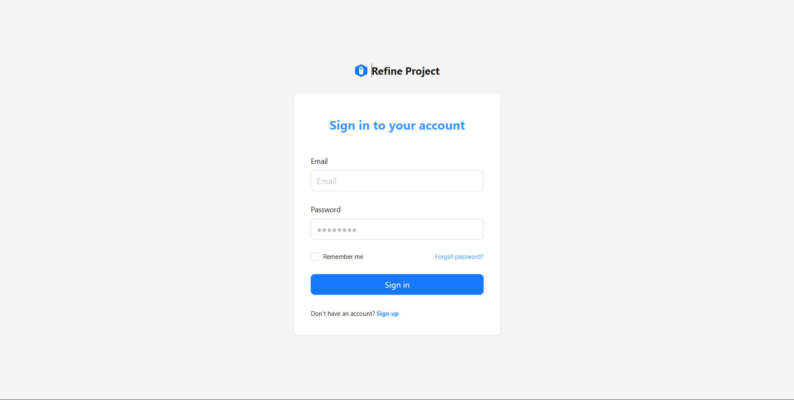

# 🎛️ Portfolio Admin Panel (CMS)


A dedicated Content Management System (CMS) to manage data for my personal portfolio website. This application allows creating, editing, and deleting content without touching the main codebase or database directly.

🔗 **Live Admin:** [https://admin-portfolio-gigih.vercel.app](https://admin-portfolio-gigih.vercel.app) *(Ganti dengan link Vercel Admin Anda)*

---

## 📸 Dashboard Preview

Manage your Projects, Experiences, and Skills effortlessly with a clean UI.

<a href="https://admin-portfolio-gigih.vercel.app">
  
</a>

---

## ✨ Key Features

* **🔐 Secure Authentication:** Integrated with Supabase Auth for admin access only.
* **🖼️ Drag & Drop Upload:** Seamless image uploading directly to Supabase Storage.
* **📝 Rich Data Management:**
    * **Projects:** Title, Slug, Tech Stack, Gallery.
    * **Experience:** Work history timeline with "Current Job" toggle.
    * **Skills & Education:** CRUD operations for other portfolio sections.
* **⚡ Instant Updates:** Changes made here reflect immediately on the main portfolio website.

## 🛠️ Tech Stack

| Category | Technology |
| :--- | :--- |
| **Framework** | [Refine](https://refine.dev/) (Vite) |
| **UI Library** | [Ant Design](https://ant.design/) |
| **Backend** | [Supabase](https://supabase.com/) |
| **Deployment** | Vercel |

## 🚀 Running Locally

1.  **Clone the repository:**
    ```bash
    git clone [https://github.com/gigihagungprasetyo/admin-portfolio-gigih.git](https://github.com/gigihagungprasetyo/admin-portfolio-gigih.git)
    cd admin-portfolio
    ```

2.  **Install dependencies:**
    ```bash
    npm install
    ```

3.  **Setup Environment:**
    Create a `.env` file in the root directory:
    ```env
    VITE_SUPABASE_URL=your_supabase_url
    VITE_SUPABASE_KEY=your_supabase_anon_key
    ```

4.  **Run Development Server:**
    ```bash
    npm run dev
    ```

---